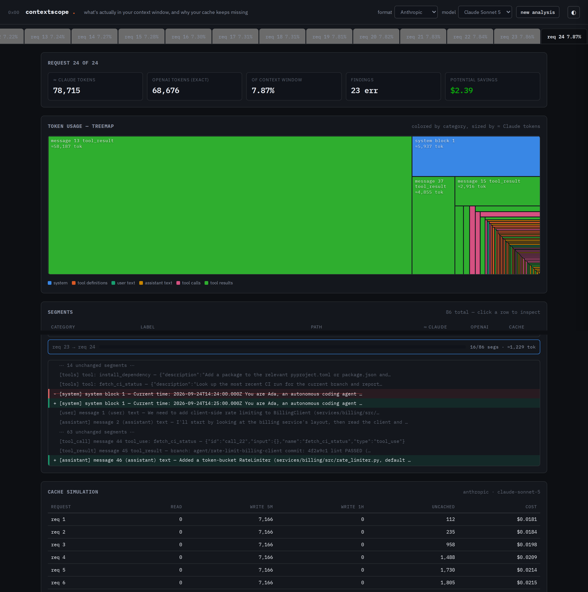
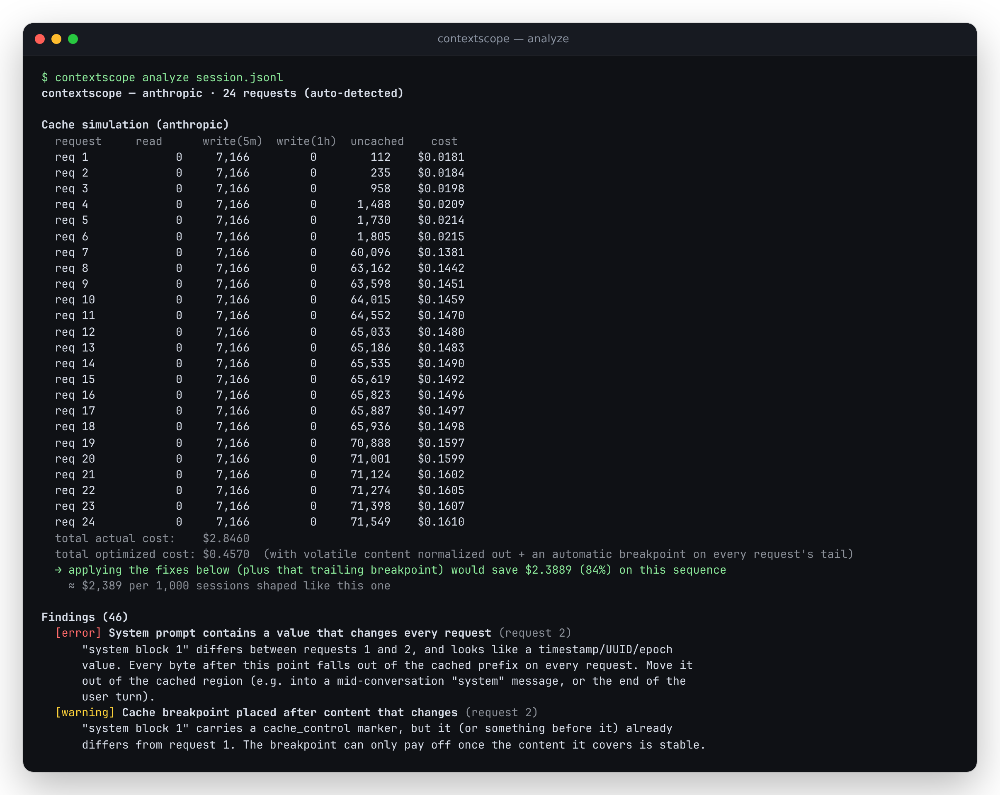
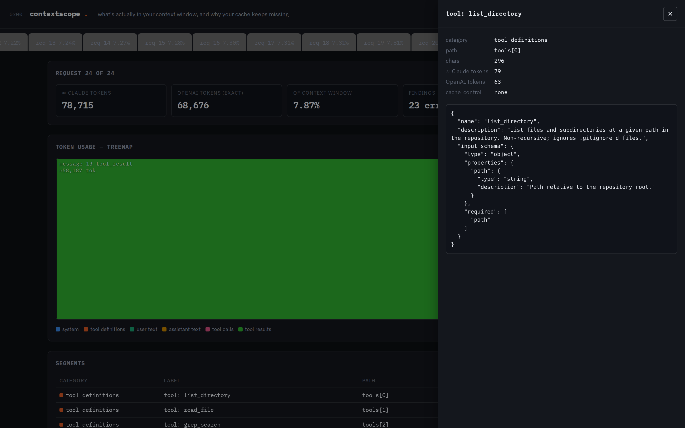
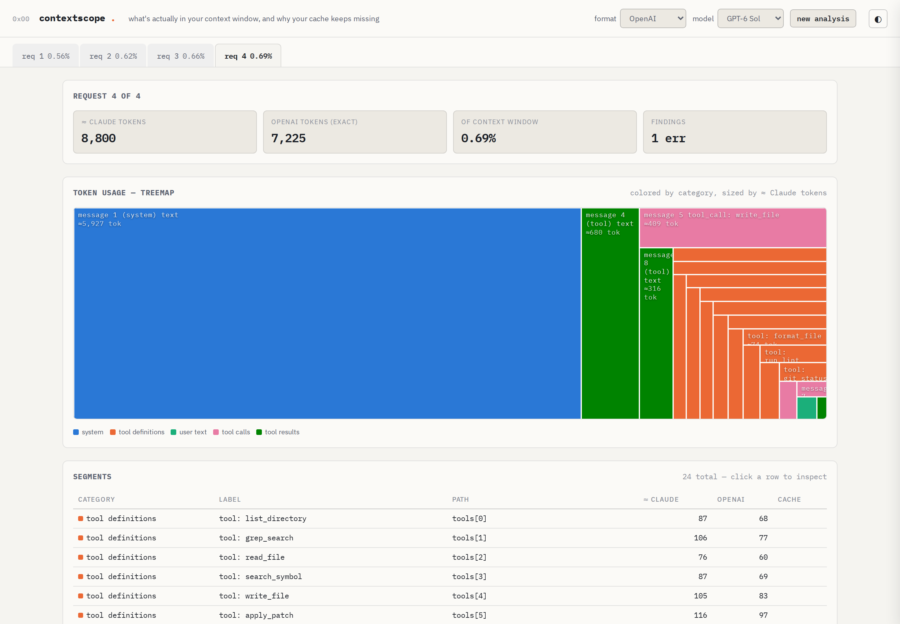

# contextscope

See what's actually in your LLM context window, and why your prompt cache keeps missing.

[](LICENSE)
[](https://antonsoo.github.io/contextscope/)

<p align="center">
  
</p>

Agentic apps send huge, fast-growing prompts, and it's genuinely hard to see which
part is eating the budget: the tool definitions, the system prompt, a 400-token
tool result, an image. Anthropic's and OpenAI's prompt caches also break
**silently** whenever anything in the prefix changes — a timestamp interpolated
into the system prompt, a tool list rebuilt from an unordered map, a reordered
array — and the only symptom is a cost and latency regression nobody notices
until the bill arrives. contextscope is a local-first analyzer for the raw JSON
requests these agents actually send: it shows where the tokens go, simulates
each provider's cache rules turn by turn, and points at the specific line that
broke the cache.

Everything runs in your browser or on your machine. Nothing is uploaded.

## Contents

- [Quickstart](#quickstart)
- [Features](#features)
- [Usage](#usage)
- [How it works](#how-it-works)
- [Accuracy and limitations](#accuracy-and-limitations)
- [Development](#development)
- [Contributing](#contributing)
- [License](#license)

## Quickstart

```sh
git clone https://github.com/antonsoo/contextscope && cd contextscope
npm install
node dist/cli/index.js analyze examples/anthropic-agent-cache-bust.jsonl
```

`npm install` runs the package's `prepare` script, which compiles the CLI and
core library with `tsc` — no separate build step. Once the repo is public, the
same CLI runs directly against your own file with no local checkout:

```sh
npx github:antonsoo/contextscope analyze your-requests.jsonl
```

(Verified locally by installing from a clean export of this repository's git
tree, which is what `npx github:...` does under the hood — see
[Development](#development) for the exact commands.)

Or skip the CLI and open **[antonsoo.github.io/contextscope](https://antonsoo.github.io/contextscope/)**,
drop a request file, or click a built-in example.

## Features

- **Token usage treemap.** Every request in a session, broken into segments —
  system, tool definitions, user/assistant text, tool calls, tool results,
  images, thinking — colored by category and sized by token count. Click a
  segment to see its raw content, path, and cache status.
- **Prompt-cache simulation across a sequence.** For each consecutive pair of
  requests, contextscope finds the longest common prefix in the provider's own
  serialization order, shows a readable diff of exactly what changed, and
  simulates cache reads/writes/misses under that provider's real rules —
  Anthropic's `cache_control` breakpoints, per-model minimum cacheable length,
  20-position lookback window, and 5-minute/1-hour TTL pricing; OpenAI's
  automatic prefix caching. It reports actual cost vs. an optimized scenario,
  the dollar difference, and a projection to ≈$ per 1,000 sessions shaped
  like the one you gave it (a straight multiplication of that session's own
  computed savings, not a separate estimate).
- **Findings with concrete fixes**, e.g. *"system prompt contains a value that
  changes every request (request 2) ... looks like a timestamp/UUID/epoch
  value"*, *"Tools reordered between requests 2 and 3"*, *"tool schema key
  order differs"*, *"no cache_control breakpoint set"*, *"prefix below minimum
  cacheable length"*.
- **Duplicate content detection** (5-word shingling + Jaccard similarity) —
  catches the same file or tool output fetched more than once in one
  conversation.
- **Two input formats, auto-detected**: Anthropic Messages API and OpenAI Chat
  Completions, as a single request, a JSON array, or JSONL (one request per
  line — the shape an agent loop actually logs).
- **Exact OpenAI token counts** (o200k_base, via `gpt-tokenizer`) and
  **estimated Claude token counts**, always labelled `≈`, with an optional
  in-browser calibration pass against Anthropic's real `count_tokens`
  endpoint.
- **A Node CLI** for CI/scripting and **a Vite + TypeScript web app** for
  interactive exploration, sharing one core library.

## Usage

### CLI

```sh
node dist/cli/index.js analyze <file> [options]

Options:
  --format <anthropic|openai>   Override auto-detected format
  --model <id>                  Model id for context-window and pricing lookups
  --html <out.html>             Also write a self-contained HTML report
  --json <out.json>             Also write the raw analysis result as JSON
```

Real output (`examples/anthropic-agent-cache-bust.jsonl`, a synthetic
24-turn, ~79,000-token coding-agent session where a timestamp inside the
system prompt busts the cache on every single turn):

<p align="center">
  
</p>

The paired example, `examples/anthropic-agent-cache-fixed.jsonl`, is the exact
same session with the timestamp removed from the cached prefix. Run it
yourself: fixing just that one bug (nothing else) already drops the cost from
$2.8460 to $2.4668 - about 13%, from a single stable breakpoint finally
reading instead of missing every time. The remaining gap to the $0.4570
"optimized" figure comes from also caching the conversation's growing tail
(an automatic breakpoint on every request), which neither example does on its
own - see "How it works" below for what the optimized scenario actually
models.

### Web app

```sh
npm run build:web      # outputs web/dist/
npm run preview:web    # serve the built app locally
```

Drop a file, paste JSON/JSONL, or pick one of four built-in synthetic
examples (all labelled synthetic in the UI, sized in the picker since the
flagship pair is a real ~5.7 MB download, fetched only when you pick it): the
24-turn cache-busting session above, its fixed counterpart, a session with a
file re-read three times, and an OpenAI session with tools reordered
mid-conversation. The view opens on the *last* request by default - the
biggest, most interesting point in a growing conversation - not the nearly
empty first turn. Click any treemap block or table row to inspect the raw
segment; click a request tab in the "prompt-cache prefix match" panel to see
the line-level diff between two consecutive requests.

<p align="center">
  
  
</p>

### As a library

```ts
import { analyze } from "contextscope";

const result = analyze(rawRequestJsonOrJsonl, { model: "claude-sonnet-5" });
// result.reports          — per-request token totals and category breakdown
// result.prefixMatches    — longest-common-prefix + diff between consecutive requests
// result.cacheSimulation  — simulated reads/writes/cost, actual vs. optimized
// result.findings         — concrete, located issues
// result.duplicates       — near-duplicate content groups
```

## How it works

**Parsing.** Each request is normalized into a flat, ordered list of
`Segment`s in the *provider's own serialization order* — for Anthropic that's
`tools → system → messages`; for OpenAI, `tools → messages` (OpenAI has no
separate top-level system field; the system/developer message is
`messages[0]`). Every other analysis operates on this normalized list, so the
two wire formats only need to be understood once, in `src/core/parse-*.ts`.

**Token counts.** OpenAI counts are exact: `gpt-tokenizer`'s pure-JS o200k_base
encoder, the same BPE vocabulary GPT-4o and newer OpenAI models use. Claude
counts are a documented heuristic (`src/core/tokenize-claude.ts`) — Anthropic
does not publish Claude's tokenizer — and are labelled `≈` everywhere. The
method: characters-per-token scaled by how symbol-dense the text is (roughly
4.0 chars/token for prose, 2.9 for JSON/code, interpolated by the fraction of
non-alphanumeric characters), since BPE tokenizers split more often on
punctuation and symbol boundaries. The web app can replace these estimates
with real counts from Anthropic's `POST /v1/messages/count_tokens` endpoint,
called directly from the browser with the `anthropic-dangerous-direct-browser-access`
header; the key is held in memory for that tab only and never stored or sent
anywhere else.

**Prefix matching and diffing.** `src/core/prefix.ts` finds the longest common
prefix between two consecutive requests' segment lists, then runs a classic
O(n·m) LCS diff over the *whole* segment list (not just the tail) so a single
reordered tool or one edited system block shows up as a small, localized
change instead of "everything after position 3 differs."

**Cache simulation.** `src/core/cache-anthropic.ts` and `cache-openai.ts`
implement each provider's documented rules:

- **Anthropic**: up to 4 `cache_control` breakpoints per request, read against
  the previous request's breakpoints if the matched prefix reaches at least
  that far and the position distance is within the 20-block lookback window
  (a run of consecutive `tool_use` or `tool_result` blocks collapses to one
  position, per Anthropic's documented rule). Writes are billed at 1.25× (5-minute
  TTL) or 2× (1-hour TTL) the input price; reads at 0.1×. A breakpoint below
  the model's minimum cacheable length (512–4096 tokens, model-dependent)
  silently never caches. Rules and pricing are from Anthropic's own
  documentation, as reproduced in this project's Claude API reference at
  build time (cached 2026-06-24).
- **OpenAI**: automatic (implicit) prefix caching — no marker needed — for
  prompts at least 1024 tokens long, with the cached portion reported rounded
  down to the nearest 128 tokens and no separate write charge. Rules and
  pricing verified via WebFetch on 2026-09-24 from
  `developers.openai.com/api/docs/guides/prompt-caching` and
  `developers.openai.com/api/docs/pricing`. OpenAI's newer explicit-breakpoint,
  30-minute-TTL caching mode (GPT-5.6 and later) is **not** simulated — a
  documented scope cut, not a guess.

The **"optimized"** scenario in both simulators normalizes ISO-8601
timestamps, UUIDs, and epoch-looking integers out of the prefix comparison
(the fix for the flagship "timestamp in the system prompt" bug), and — for
Anthropic — adds a trailing `cache_control` breakpoint to every request (the
"automatic caching on the growing tail" pattern), then re-runs the same
simulation. The dollar difference is the number in the "potential savings"
tile.

**Duplicate detection.** 5-word shingles hashed with FNV-1a, grouped by
Jaccard similarity ≥ 0.85 (union-find), scoped to the *last* request in a
sequence only. In the agentic-loop shape this tool targets, every later
request resends the whole conversation so far, so comparing across requests
would "detect" every earlier turn as a duplicate of itself in every later
request — that's just how the API works, not a bug. The last request already
contains the full accumulated context, so scanning it alone still catches the
real case this feature is for: the same file or tool output fetched more than
once in one conversation.

**Findings.** A fixed set of rule-based checks over the parsed sequence, the
prefix diffs, and the duplicate groups (`src/core/findings.ts`) — not an LLM
judgment call, so the same input always produces the same findings.

**Categorical palette.** The eight segment categories use a colorblind-safe
palette (worst-case simulated CVD ΔE ≥ 8.4 OKLab, worst-case normal-vision ΔE
≥ 19.3, both checked against the actual dark and light surface colors, not a
neutral default) in a fixed hue order, so color always means the same category
across every chart in the app.

**Treemap.** A hand-rolled squarified treemap (Bruls, Huizing & van Wijk,
2000) — about 40 lines, in `web/src/lib/treemap.ts` — rather than a
dependency, since it's one layout call.

## Accuracy and limitations

- **Claude token counts are estimates, always.** There is no public Claude
  tokenizer; the heuristic above is not calibrated against real Anthropic
  usage data, only checked for the qualitative behavior described (denser
  text → more tokens per character). Use the in-browser calibration feature
  against a real API key for counts you need to trust.
- **OpenAI token counts are exact** for the o200k_base encoding, cross-checked
  in `tests/tokenize-openai.test.ts` against `js-tiktoken` — a second,
  independently maintained pure-JS tokenizer implementation — on 9 varied
  samples (prose, code, JSON, non-English text, emoji, repeated text); all
  match exactly. Requests for a model that uses a different encoding will
  still report the o200k_base count, not that model's real count.
- **The cache simulation is a documented model, not a live measurement.** It
  has no wall-clock timestamps to work from, so it assumes every request in a
  sequence arrives within the relevant TTL (the steady-agent-loop case this
  tool targets) — it does not model a cache entry expiring between requests
  that are minutes apart. The Anthropic simulator handles one
  request-composition pattern (breakpoints on cumulative prefixes); exotic
  breakpoint placements (e.g. deliberately non-monotonic TTL ordering across
  many blocks) are simplified.
- **Duplicate detection is scoped to the last request only** (see "How it
  works" above) — it will not flag near-duplicates across two *unrelated,
  independent* requests in a batch that isn't a growing conversation.
- **The web app's exact-tokenizer chunk is large, and so is the flagship
  example.** `gpt-tokenizer`'s o200k_base vocabulary is ~1 MB gzipped; both
  it and each built-in example are code-split and fetched only when actually
  used (not on page load — the drop-zone screen ships in <20 KB gzipped), but
  picking the 24-turn flagship example downloads a real ~5.7 MB JSONL file
  (labelled with its size in the picker). Both are cached by the browser
  after the first load.
- **Performance**: analyzing that same flagship session (24 requests, 5.7 MB,
  growing to 78,715 tokens by the last request) takes ≈0.59 s end-to-end in
  the CLI, including Node startup, on this box (14 vCPU WSL2 Linux, 48 GB
  RAM). A synthetic 300-request / 2.9 MB stress case (4,000 segments) runs
  the core `analyze()` call itself in ≈890 ms.
- Synthetic example data is clearly labelled synthetic, in both the CLI
  filenames and the web app's example picker.

## Development

```sh
npm install        # installs deps and builds dist/ via the `prepare` script
npm run lint        # eslint
npm run typecheck   # tsc --noEmit, core+cli and the web app
npm test             # vitest — 59 tests
npm run build        # core + cli (dist/) and the web app (web/dist/)
npm run dev:web       # Vite dev server for the web app
```

To verify the "install from GitHub" flow without a public remote yet, export
a clean copy of the tracked git tree and install into it — this is what
`npx github:antonsoo/contextscope` does under the hood:

```sh
git archive HEAD | tar -x -C /tmp/contextscope-check
cd /tmp/contextscope-check && npm install   # runs `prepare`, builds dist/
node dist/cli/index.js analyze examples/anthropic-agent-cache-fixed.jsonl
```

Regenerating the example sessions (`examples/*.jsonl`):

```sh
node scripts/generate-examples.mjs
```

The flagship pair is built from `scripts/lib/` - a long, internally-consistent
"enterprise coding agent" system prompt, a 16-tool surface, and a library of
realistic (synthetic) file contents, diffs, and test/lint/CI output for a
fictional `ledger-core` billing repository - assembled into a 24-turn
transcript. Nothing in it is copied from a real project; it exists to make
the treemap and the dollar figures reflect a session at real agentic-loop
scale (tens of thousands of tokens, not a few hundred) instead of a toy-sized
one. Re-run the script after editing anything under `scripts/lib/` to
regenerate all four example files from the same source.

Project layout:

```
src/core/     shared library: parsers, tokenizers, prefix/diff, cache
              simulation, findings, duplicates (no I/O, no DOM - pure functions)
src/cli/      Node CLI: terminal + HTML report renderers
web/          Vite + TypeScript web app (imports src/core directly, no framework)
tests/        vitest suite for src/core
scripts/      generates examples/*.jsonl (not part of the shipped library/CLI)
examples/     synthetic example sessions, shared by the CLI and the web app
docs/assets/  README screenshots
```

## Contributing

See [CONTRIBUTING.md](CONTRIBUTING.md).

## License

[MIT](LICENSE) © 2026 Anton Soloviev
