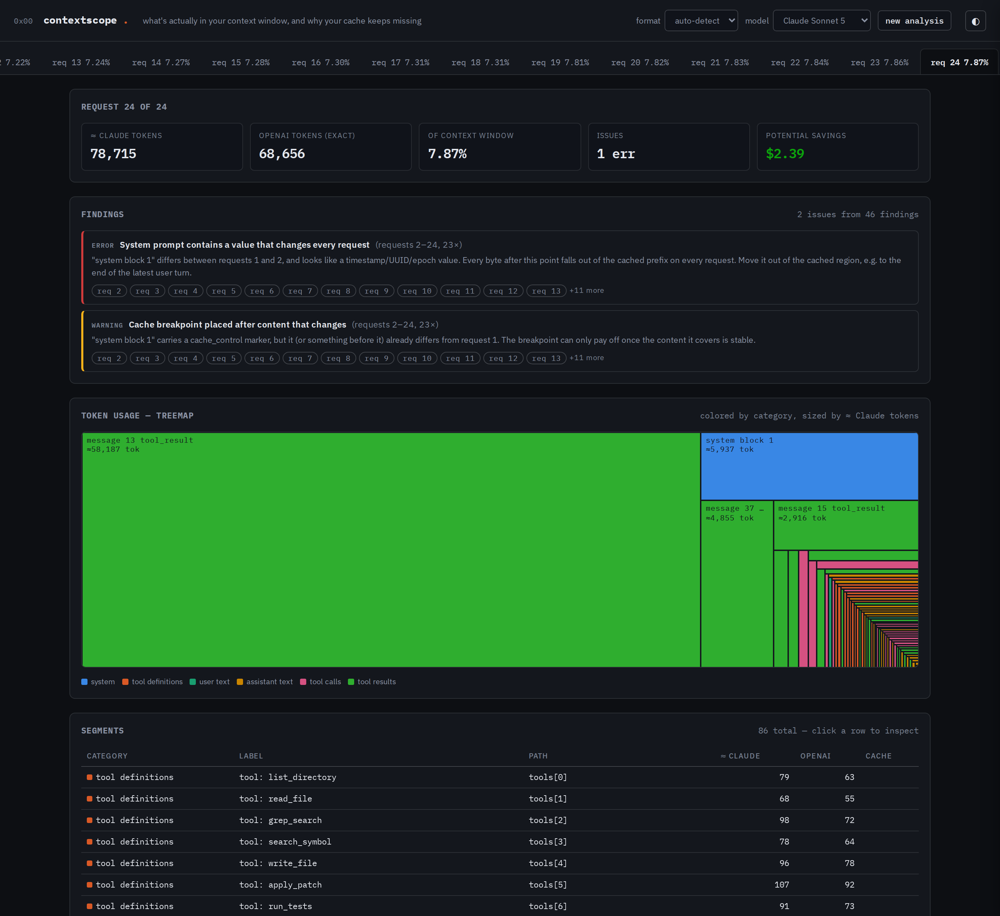
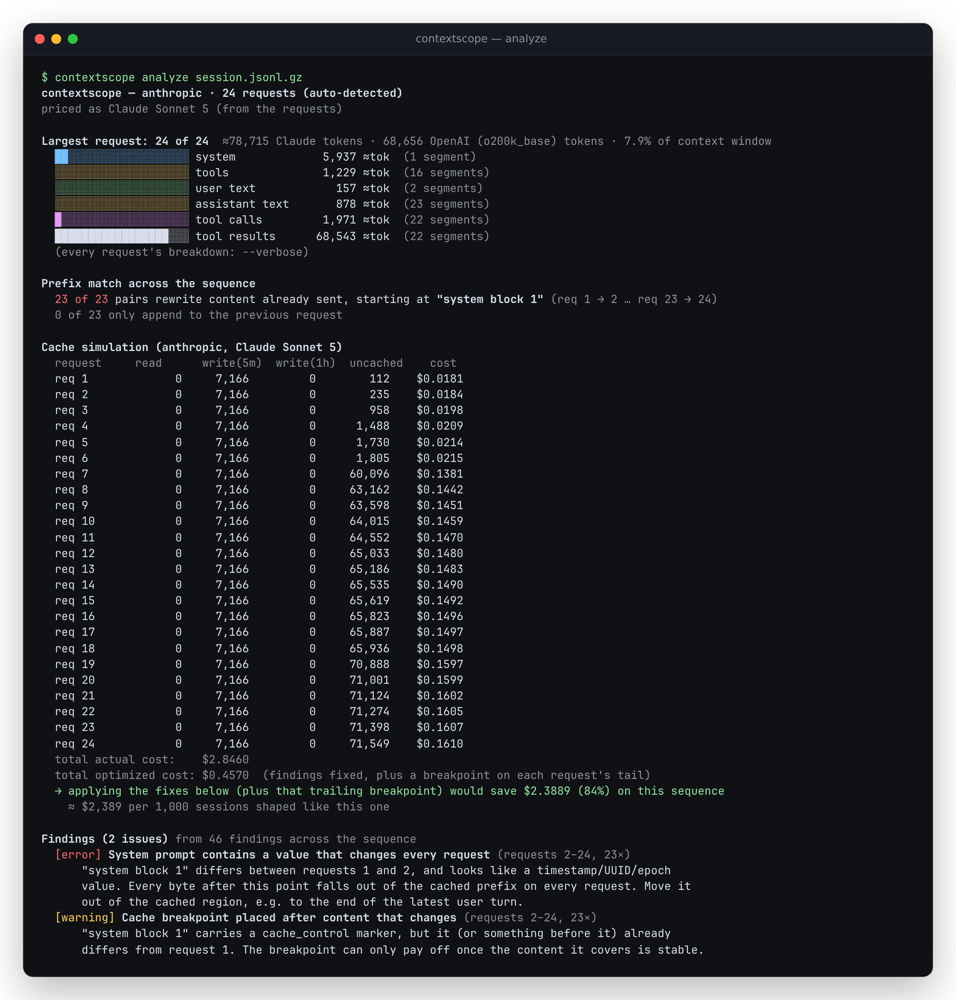
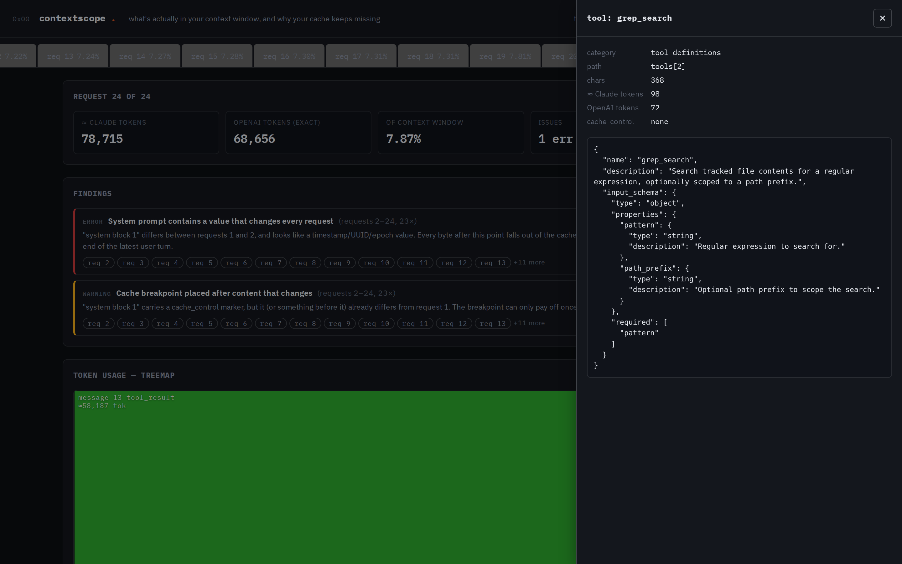
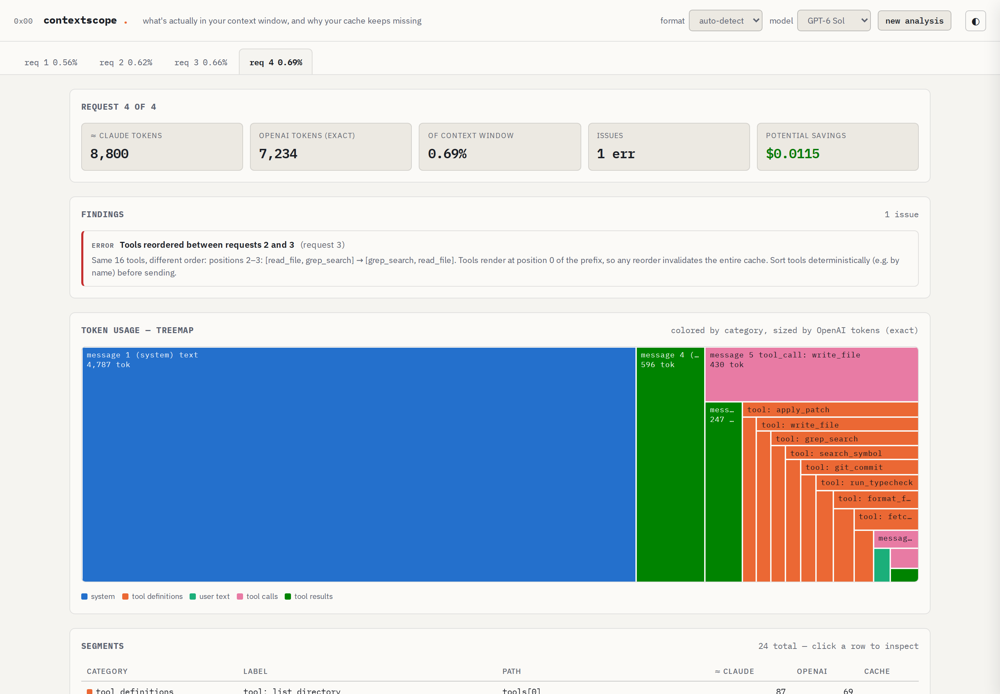
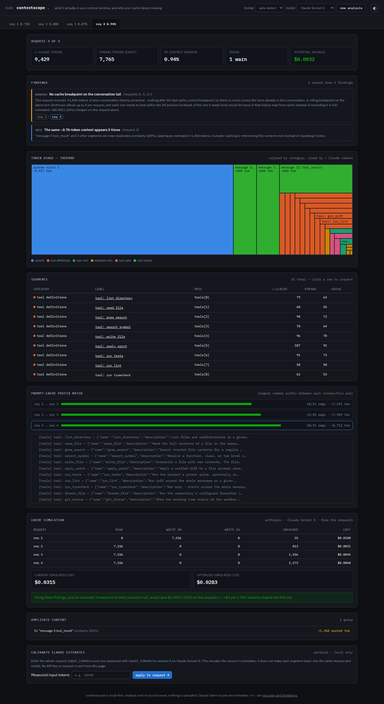
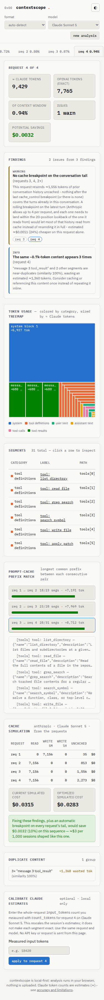

# contextscope

See what's actually in your LLM context window, and why your prompt cache keeps missing.

[](https://www.npmjs.com/package/@antonsoloviev/contextscope)
[](LICENSE)
[](https://antonsoo.github.io/contextscope/)

<p align="center">
  
</p>

Agentic apps send huge, fast-growing prompts, and it's genuinely hard to see which
part is eating the budget: the tool definitions, the system prompt, a 400-token
tool result, an image. Anthropic's and OpenAI's prompt caches also break
**silently** whenever anything in the prefix changes (a timestamp interpolated
into the system prompt, a tool list rebuilt from an unordered map, a model
switch mid-conversation), and the only symptom is a cost and latency regression
nobody notices until the bill arrives. contextscope is a local-first analyzer for
the raw JSON requests these agents actually send: it shows where the tokens go,
simulates each provider's cache rules turn by turn, and points at the specific
block that broke the cache.

Everything runs in your browser or on your machine. Nothing is uploaded, and the web app's
Content-Security-Policy (`connect-src 'self'`) has the browser enforce that: the page cannot
send what you paste to any other host.

## On real agent trajectories

The first measurement of contextscope against what a provider reported, not against
requests its own author wrote: 360 SWE-bench agent runs (mini-SWE-agent, public
[trajectories](studies/real-trajectories/README.md)), 12,760 requests rebuilt from them, each
next to the `usage` the API returned for it. Claude Sonnet 4.5, Opus 4.5, Haiku 4.5, Opus 4.6,
gpt-5.1 and gpt-5.2.

- **Claude token counts were 15 to 25% low (0.3.3).** Code and command output tokenize denser
  than the estimate assumed. Re-fitted on half of the trajectories, the held-out mean error is
  +1.6 to +3.3% on plain-text sessions and −6.5 to −11.3% on sessions that send tools (the
  roughly 500-token tool-use system prompt is not modelled). This checkout only.
- **OpenAI counts are exact once the message framing is added.** `prompt_tokens` was the
  o200k_base count of the contents plus exactly 5 per message, in 2,205 of 2,205 requests.
  0.3.3 left the 5 out (0.8 to 1.1% low).
- **This checkout had broken the cache simulation on tool-using Claude sessions.**
  A tool result sent as a string in one request and as a one-element list of text blocks in
  the next was read as different content. On mini-SWE-agent 2.0 sessions the agreement with
  Anthropic on "did this request read the cache" fell from 88 to 100% (0.3.3) to 6.5 to 23%, and
  5,715 requests that did read the cache got a "breakpoint is outside the 20-position lookback
  window" finding. 0.3.3 is not affected; the fix is in this checkout.
- **With those fixed it agrees with Anthropic on 96 to 100% of requests** about whether the
  cache was read, and its predicted share of input tokens read from cache is within 0.0 to
  1.6 points of the reported one. Two Claude 4.5 models were missing from the model table and
  were checked against a 512-token minimum instead of 4,096 (Opus 4.5).
- **For OpenAI the simulation is an upper bound.** 27% of requests matched the reported
  `cached_tokens` exactly; 34% got none where it predicted a read. gpt-5.2 cached 56 to 57% of
  the predicted tokens, gpt-5.1 88%.

## Contents

- [Quickstart](#quickstart)
- [Features](#features)
- [Usage](#usage)
- [How it works](#how-it-works)
- [On real agent trajectories](#on-real-agent-trajectories)
- [Accuracy and limitations](#accuracy-and-limitations)
- [Development](#development)
- [Contributing](#contributing)
- [License](#license)

## Quickstart

Run it against your own request log:

```sh
npx @antonsoloviev/contextscope analyze your-requests.jsonl
```

That runs the published package
([`@antonsoloviev/contextscope`](https://www.npmjs.com/package/@antonsoloviev/contextscope)
on npm; the command it installs is `contextscope`). To try the bundled
examples, clone the repository:

```sh
git clone https://github.com/antonsoo/contextscope && cd contextscope
npm install
node dist/cli/index.js analyze examples/anthropic-agent-cache-bust.jsonl.gz
```

`npm install` runs the package's `prepare` script, which compiles the CLI and
library with `tsc`.

Or skip the CLI and open **[antonsoo.github.io/contextscope](https://antonsoo.github.io/contextscope/)**:
drop a request file, paste one, or click a built-in example.

## Features

- **Token usage treemap.** Every request in a session, broken into segments
  (system, tool definitions, user/assistant text, tool calls, tool results,
  images, thinking), colored by category and sized by tokens. Click a segment to
  see its raw content, path, and cache status.
- **Prompt-cache simulation across a sequence.** For each request and the
  request it continues, contextscope finds the longest common prefix in the provider's own
  serialization order, shows a readable diff of exactly what changed, and
  simulates cache reads, writes and misses under that provider's rules:
  Anthropic's `cache_control` breakpoints, per-model minimum cacheable length,
  20-position lookback window and 5-minute/1-hour write pricing; OpenAI's
  automatic prefix caching. It reports actual cost against an optimized
  scenario, and projects the difference to 1,000 sessions shaped like yours (a
  straight multiplication, not a separate estimate).
- **Logs of more than one conversation.** A proxy capture of an agent holds
  its main loop and, between the turns, side requests on another model; a
  gateway's log holds every user's conversation, interleaved. Each request is
  matched to the request it continues, wherever in the file that is, and the
  cache is simulated as the providers keep it: by content, per model. A
  session reads the same whether it is alone in the file or not.
- **Priced as the model you actually used.** The model named in the requests
  picks the pricing and cache rules (dated snapshots and Bedrock/Vertex ids
  included); `--model` overrides it, and an id with no pricing entry is reported
  instead of silently priced as something else. All eleven current Claude
  models are covered, including the ones whose minimum cacheable prefix or
  cache-read price differs from the usual, and (source checkout) the two 4.5
  models that coding agents still run, Opus 4.5 and Sonnet 4.5.
- **Findings with concrete fixes**, grouped so a problem that recurs on every
  request is reported once: *"System prompt contains a value that changes every
  request (requests 2–24, 23×)"*, *"Tools reordered between requests 2 and 3:
  positions 2–3: [read_file, grep_search] → [grep_search, read_file]"*, *"tool
  schema key order differs"*, *"Model changed mid-conversation"*, *"prefix below
  Claude Opus 4.6's 4,096-token minimum"*, *"No cache breakpoint on the
  conversation tail"* (often the single highest-value fix for a real agent loop).
- **Duplicate content detection** (5-word shingling + Jaccard similarity): the
  same file or tool output fetched more than once in one conversation.
- **Reads the files you already have.** Anthropic Messages bodies, OpenAI Chat
  Completions and Responses API bodies, as a single request, a JSON array, or
  JSONL, optionally gzipped. The parsers are tested on request bodies written
  by the real Python SDKs (`tests/fixtures/sdk/`), not only on hand-made ones. Anthropic Message Batches and OpenAI Batch API
  files, and gateway logs that wrap each body in `request`/`request_body`, are
  unwrapped automatically. The format is auto-detected.
- **Exact OpenAI token counts** (o200k_base, via `gpt-tokenizer`) and
  **estimated Claude token counts**, always labelled `≈`, with optional
  calibration against a measured whole-request count. The CLI can call
  Anthropic's `count_tokens` endpoint; the browser accepts a count you supply locally.
- **A Node CLI** that works as a CI gate (`--fail-on warning` exits 2) and
  writes HTML or JSON reports, and **a Vite + TypeScript web app** for
  interactive exploration, sharing one core library.

## Usage

### CLI

```text
contextscope analyze <file> [options]

Options:
  --format <anthropic|openai>     Override auto-detected format
  --model <id>                    Price as this model (default: the model named in the requests)
  --calibrate                     Anthropic only: count the largest request exactly with the
                                  count_tokens endpoint (reads ANTHROPIC_API_KEY) and scale
                                  every Claude estimate to match
  --fail-on <error|warning|info>  Exit 2 for incomplete input or a finding at least this severe
  --html <out.html>               Also write a self-contained HTML report
  --json <out.json>               Also write the analysis as JSON: counts, findings and cache
                                  steps for every request and segment, without raw prompt values
  -v, --verbose                   Show every request's breakdown and every prefix/cache row
```

Exit status is 0 on success, 1 on bad arguments or unreadable input, and 2
when `--fail-on` is set and either input coverage is incomplete or a finding
meets the threshold. Gzipped input is detected by
extension or, failing that, by gzip magic bytes.

Real output on `examples/anthropic-agent-cache-bust.jsonl.gz`, a synthetic
24-turn, ~79,000-token coding-agent session where a timestamp inside the system
prompt busts the cache on every turn:

<p align="center">
  
</p>

The screenshots, and the token counts and dollar figures in this section and
the next, come from 0.3.3. This checkout's larger Claude estimate (see
[On real agent trajectories](#on-real-agent-trajectories)) prices the same two
sessions at $3.4459 actual and $0.5533 optimized, still 84% lower; the findings
are unchanged. The other percentages here were not recomputed.

The paired example, `examples/anthropic-agent-cache-fixed.jsonl.gz`, is the
same session with two changes: the timestamp is gone from the system prompt,
and a second `cache_control` breakpoint rolls forward onto the latest turn of
every request, next to the first breakpoint on the static system prompt. That
is the "one breakpoint on the stable prefix, one rolling on the growing tail"
pattern Anthropic recommends for agent loops. Fixing only the timestamp and
stopping there is a common half-fix: the system-prompt breakpoint finally reads,
but every turn still resends the whole conversation history uncached, because
nothing marks where that history ends. contextscope has a finding for that gap
(`missing_tail_breakpoint`), so it never reports "no findings" while still
showing a large potential saving. On the fixed example, actual cost is $0.4570,
identical to the optimized figure, with zero findings. The timestamp fix alone
would have saved 13.3%; both fixes together save 84%.

### Web app

```sh
npm run build:web      # outputs web/dist/
npm run preview:web    # serve the built app locally
```

Drop a file (plain or gzipped), paste JSON/JSONL, or pick one of four built-in
synthetic examples, labelled as such: the 24-turn cache-busting session above
(a ~5.7 MB session, shipped gzipped at ~0.48 MB and fetched only when you pick
it), its fixed counterpart, a session with a file re-read three times, and an
OpenAI session with tools reordered mid-conversation. The view opens on the
*last* request, where a growing conversation is biggest. Findings come first,
each with links to every request it fired on; below them are the treemap, the
segment table, the line-level diff between each request and the one it
continues, and the cache table. A file of several conversations opens on its
largest request. The format and model pickers in the top bar override detection for the
current input only.

<p align="center">
  
  
</p>

### As a library

```ts
import { analyze, groupFindings } from "@antonsoloviev/contextscope";

const result = analyze(rawRequestJsonOrJsonl); // or { model: "claude-opus-5-5" } to override
// result.model            — the model priced with, and whether it came from the requests
// result.parse.complete   — false for skipped/non-request records or a mismatched format override
// result.parse.requests[i].source — original record index, JSONL line, and envelope field
// result.reports          — per-request token totals and category breakdown
// result.prefixMatches    — longest common prefix + diff between each request and the one it continues
// result.conversations    — how many conversations the input holds, and which one each request is in
// result.cacheSimulation  — simulated reads/writes/cost, actual vs. optimized
// result.findings         — concrete, located issues (groupFindings() collapses repeats)
// result.duplicates       — near-duplicate content groups
```

## How it works

**Parsing.** Each request is normalized into a flat, ordered list of
`Segment`s in the *provider's own serialization order*: `tools → system →
messages` for Anthropic, and `tools → messages` for OpenAI (whose system or
developer message is `messages[0]`, or `instructions` in the Responses API).
Every other analysis operates on this list, so the wire formats are understood
once, in `src/core/parse-*.ts`. Each record can be a raw body or a supported
`params`, `body`, `request`, or `request_body` envelope, including a JSON-encoded
body string. Two possible bodies in one record are rejected as ambiguous.
Original record positions and physical JSONL lines are retained after skips.
Strong evidence for both providers requires separate analyses; an explicit
format override remains available, with warnings and incomplete status for
mismatches. Repeated plain-text messages cannot outweigh a provider signal.

Duplicate JSON fields (including escaped equivalent keys), numbers that overflow
or turn a nonzero value into zero,
and nesting beyond 128 containers are rejected. Malformed JSONL syntax is
retained as a visible coverage gap: `parse.complete` is false,
`parse.sourceRecords` includes skipped nonblank lines, and `parse.skippedRecords`
counts malformed lines plus records with no analyzable segments. Any configured
`--fail-on` gate exits 2 for incomplete input, regardless of finding severity.
Reports retain the partial evidence and warnings. Completeness describes source
coverage, not API validity or measured cache behavior. An empty request array is
an error.

File decoding is strict UTF-8, or UTF-16 selected by its byte-order mark. Corrupt
encodings are rejected before replacement characters can rewrite the evidence,
including gzipped inputs. A real U+FFFD character in a valid encoding is retained.

**Token counts.** OpenAI counts are exact: `gpt-tokenizer`'s pure-JS o200k_base
encoder, the BPE vocabulary GPT-4o and newer OpenAI models use. Claude counts
are a documented heuristic (`src/core/tokenize-claude.ts`), because Anthropic
does not publish Claude's tokenizer, and they are labelled `≈` everywhere. The
method: characters per token scaled by how symbol-dense the text is (about 3.3
chars/token for prose and 2.5 for JSON/code, interpolated by the fraction of
non-alphanumeric characters), since BPE tokenizers split more often on
punctuation. (Source checkout: these were 4.0 and 2.9 in 0.3.3, which counted
the agent transcripts in [the real-trajectory study](studies/real-trajectories/README.md)
20 to 30% low.) An agent loop re-sends its whole history on every request, so each
distinct segment text is tokenized once per analysis: the flagship session has
1,259 segments but only 109 distinct ones.

**Calibration.** The CLI's optional `--calibrate` flag sends the largest
Anthropic request to `POST /v1/messages/count_tokens`, using the API key you
provide. This is the only network operation in the CLI. In the web app,
enter the measured `input_tokens` total for the selected request and model in
**Calibrate Claude estimates**. The browser does not ask for an API key or
contact Anthropic; its same-origin network policy remains enforced.

Both paths divide the measured whole-request count by the original heuristic
estimate and rescale the session's Claude estimates. The UI identifies the
reference request, model, count, and scale. Other requests and individual
segments remain estimates; rounding means their sum may differ slightly from
the measured total. Repeating a calibration starts from the original input,
so scales do not compound. Undo it at any time; changing the model, format,
or input clears it.

**Conversations.** A request log is rarely one conversation, and the line
before a request is then some other conversation's. `src/core/threads.ts` pairs
each request with the earlier request it continues: the one whose messages it
starts with, all of them and in order (the previous turn of an agent loop);
failing that, a recent request at least half of whose messages it re-sends (the
same conversation with its history edited: a sliding window, a trimmed tool
result); failing that, the earlier request that shares the most of its tools
and system prompt once volatile values and ordering are normalized away (a new
conversation of the same application, compared only as far as that shared
setup). A request that matches nothing starts a conversation with nothing to
compare it to. Prefixes are interned in a trie, so analyzing 3,000 requests of
150 interleaved conversations takes about half a second. In a file that is one
conversation, every request is paired with the one before it, as before.

Real output for the fixed example session with a 27-token request on another
model after every second turn (36 requests; alone, the session costs $0.4570
and has no findings):

```
contextscope — anthropic · 36 requests in 13 conversations (auto-detected)
priced as Claude Sonnet 5 (from the requests)
...
Prefix match across the sequence
  13 conversations in this file; each request is compared with the request it continues
  all 23 follow-up requests only append to the request they continue
  11 requests start a new conversation on a setup already sent
...
  total actual cost:    $0.4576
  total optimized cost: $0.4576  (findings fixed, plus a breakpoint on each request's tail)

No findings — this sequence caches cleanly.
```

**Prefix matching and diffing.** `src/core/prefix.ts` finds the longest common
prefix between the segment lists of a request and the one it continues, then diffs the *whole*
lists, not just the tail, so a single reordered tool or one edited system block
shows up as a small, localized change instead of "everything after position 3
differs." Identity includes the original prompt block, message header and message
boundary, separately from the text used for token counts. Tool destinations,
error flags, thinking signatures, document metadata and speaker names therefore
cannot disappear from a prefix comparison when visible text stays the same.
Metadata-only changes are marked in readable diffs. The optimized scenario sorts
keys and parameterizes volatile text while preserving routing IDs, names, roles,
types and signed/opaque thinking. Following tool calls have their own identity;
they are not compared as part of the assistant text before them.
The diff is Myers' O((N+M)·D) algorithm (E. W. Myers, "An O(ND)
Difference Algorithm and Its Variations", *Algorithmica* 1, 1986): consecutive
agent requests differ by a few edits, so D is small even when N and M are in
the thousands. A randomized test checks that the unchanged lines always form a
longest common subsequence.

**Cache simulation.** `src/core/cache-anthropic.ts` and `cache-openai.ts`
implement each provider's documented rules:

- **Anthropic**: up to 4 `cache_control` breakpoints per request. A top-level
  `cache_control`, beside `model` (automatic caching), is a breakpoint on the
  last cacheable block of the request, the last block that is not thinking or
  empty text; it is simulated like a marker placed there by hand, and takes
  one of the four. Breakpoints are read against
  the entries earlier requests wrote at theirs: an entry is read if its prefix
  matches this request's modeled prompt units up to that point, whichever earlier
  request wrote it, and the position distance is within the 20-block lookback window (a
  run of consecutive `tool_use` or `tool_result` blocks counts as one position,
  per Anthropic's documented rule). Writes cost 1.25× (5-minute TTL) or 2×
  (1-hour TTL) the input price. Reads cost 0.1× on most models, but 0.05× on
  Claude Opus 5.5 and 0.025× on Claude Fable 5.1. A breakpoint below the
  model's minimum cacheable length silently never caches, and that minimum is
  not monotonic across generations: 512 tokens on the newest models, 1,024 on
  Opus 4.8 and Sonnet 5, 2,048 on Opus 4.7, 4,096 on Opus 4.6 and Haiku 4.5.
  Figures are from Anthropic's pricing and prompt-caching documentation as of
  2026-09-25.
- **OpenAI**: automatic (implicit) prefix caching, with no marker needed, for
  prompts of at least 1,024 tokens, with the cached portion (the longest prefix
  any earlier request sent) rounded down to the
  nearest 128 tokens and no separate write charge. Rules and pricing are from
  `developers.openai.com/api/docs/guides/prompt-caching` and
  `developers.openai.com/api/docs/pricing` as of 2026-09-24. OpenAI's newer
  explicit-breakpoint, 30-minute-TTL caching mode (GPT-5.6 and later) is **not**
  simulated: a file that uses it (`prompt_cache_options`,
  `prompt_cache_breakpoint`) gets a note saying so, and one saying that
  `mode: "explicit"` with no breakpoint caches nothing.
- **Both**: a cached prefix is the model's own attention state, so a request
  reads only what earlier requests on its own model cached, however much of the
  prefix another model was sent.

The **"optimized"** scenario re-runs the same simulation with the findings
fixed: ISO-8601 timestamps, UUIDs and epoch-looking integers are normalized out
of the prefix comparison (the "timestamp in the system prompt" fix), JSON keys
and the tool list are put in a deterministic order, and, for Anthropic, every
request gets a trailing `cache_control` breakpoint (the "automatic caching on
the growing tail" pattern). The actual scenario compares blocks exactly as sent,
key order included, so a schema whose keys drift is a miss there and a saving
here. A `cache_control` marker itself is never part of the comparison: a
rolling breakpoint moves every turn without changing the cached content. The
dollar difference is the "potential savings" figure.

**Duplicate detection.** 5-word shingles hashed with FNV-1a, grouped by Jaccard
similarity ≥ 0.85 (union-find), scoped to the *last* request of each
conversation. In an agent loop every later request resends the whole
conversation, so comparing across requests would flag every earlier turn as a
duplicate of itself. The last request already contains the full accumulated
context, so scanning it alone still catches the real case: the same file or
tool output fetched more than once in one conversation.

**Findings.** A fixed set of rule-based checks over the parsed sequence, the
prefix diffs and the duplicate groups (`src/core/findings.ts`), not an LLM
judgment, so the same input always produces the same findings. Most are
structural (a reordered tool, a changed schema, a model switch). One,
`missing_tail_breakpoint`, is derived from the Anthropic simulation's own
actual-vs-optimized cost gap, so the findings and the "potential savings"
figure can't contradict each other: whenever fixing the findings would lower
the cost by 10% or more, at least one finding says so. "No findings" is a
factual claim: the simulated optimized cost is (within rounding) the actual
cost already. Advice is model-aware; for example, a mid-conversation `system`
message is suggested only for models that accept one.

**Categorical palette.** The eight segment categories use a colorblind-safe
palette (worst-case simulated CVD ΔE ≥ 8.4 OKLab, worst-case normal-vision ΔE
≥ 19.3, both checked against the actual dark and light surface colors) in a
fixed hue order, so a color always means the same category.

**Treemap.** A hand-rolled squarified treemap (Bruls, Huizing & van Wijk,
2000), about 40 lines in `web/src/lib/treemap.ts`.

## Accuracy and limitations

- **Claude token counts are estimates** unless calibrated. There is no public
  Claude tokenizer, and Claude's tokenizers differ between generations
  (Anthropic documents that the tokenizer introduced with Opus 4.7 uses up to
  about 1.35× as many tokens as Opus 4.6's for the same text), so no single
  heuristic can be accurate for every model. Measured against the input tokens
  Anthropic reported for 10,555 requests on Claude Sonnet 4.5, Opus 4.5,
  Haiku 4.5 and Opus 4.6 ([study](studies/real-trajectories/README.md)), 0.3.3
  was 15 to 25% low on average. In this checkout, on trajectories held out of
  the fit, the mean error is +1.6 to +3.3% on plain-text sessions and −6.5 to
  −11.3% on sessions that send tools, with 95% of requests within 11 to 15% and
  13 to 22% respectively. The tool-use system prompt Anthropic adds (about 500
  tokens on these models) and thinking blocks are not modelled. Nothing is
  measured for Opus 4.7 and later. Calibration aligns the total for the counted
  request, subject to segment rounding; segments denser or sparser than that
  request's average keep some error.
- **OpenAI token counts are exact** for the o200k_base encoding, cross-checked
  in `tests/tokenize-openai.test.ts` against `js-tiktoken`, an independently
  maintained pure-JS tokenizer, on 9 varied samples (prose, code, JSON,
  non-English text, emoji, repeated text); all match exactly. A model that uses
  a different encoding still gets the o200k_base count. Chat Completions
  messages with plain-string content carry 5 framing tokens each in this
  checkout, the amount gpt-5.1 and gpt-5.2 reported for 2,205 requests with no
  exception (0.3.3 left them out and was 0.8 to 1.1% low); messages with array
  content, tool calls or tool definitions have framing that has not been
  measured and is still not counted.
- **For OpenAI the cache simulation is an upper bound, and on gpt-5.2 a loose one.**
  Against the `cached_tokens` OpenAI reported for 2,085 steps whose prefix the
  tool predicted would be cached, 27% matched exactly, 34% reported no cached
  tokens at all and 38% fewer than predicted. gpt-5.1 cached 88% of the
  predicted tokens, gpt-5.2 56 to 57%. OpenAI states that hits are not
  guaranteed and that cached state lives on individual machines. For Anthropic
  the same comparison agreed on whether a request read the cache in 96 to 100%
  of 10,555 requests.
- **The cache simulation is a documented model, not a measurement.** Request
  bodies carry no timestamps, so it assumes every request arrives within the
  TTL (the steady agent loop this tool targets) and never models an entry
  expiring between requests minutes apart. Matching is at segment granularity:
  OpenAI caches at token granularity, so a change near the end of a long
  segment earns partial credit there that this simulation doesn't give, which
  can underestimate token-prefix reuse. Prompt identities retain source structure;
  they are not a reproduction of a provider's private prompt renderer or a
  guarantee of its live cache behavior. A sequence is priced as a single
  model (the one named most often); a model switch is treated as a cache miss,
  not re-priced. Exotic breakpoint placements (for example deliberately
  non-monotonic TTLs across many blocks) are simplified.
- **Server-side state is invisible.** A Responses API request that continues a
  stored response (`previous_response_id`) carries only its new input; the tool
  warns and analyzes what is in the file.
- **Duplicate detection is scoped to the last request of each conversation**,
  so it won't flag the same content appearing in two different conversations.
- **Conversations are told apart by their content.** Two conversations that
  send exactly the same messages are one as far as the analysis can see, which
  is also how the cache sees them. A conversation whose history is replaced
  wholesale (a summary in place of every earlier message) is read as a new
  conversation, not as a rewrite of the old one.
- **The web app's exact-tokenizer worker is large.** Its o200k_base vocabulary
  is fetched when analysis starts, not on page load. The flagship example is a separate
  ~0.48 MB static asset, decompressed in the browser with `DecompressionStream`.
- **Input limits.** The browser accepts up to 50 MiB and the CLI up to 500 MiB,
  for both the input bytes and the decompressed JSON. Reads and gzip inflation
  stop at the limit. Split larger logs into separate sessions. Browser import
  reads and computation can be cancelled or replaced. Parsing, tokenization,
  cache simulation and calibration run in disposable same-origin workers;
  cancellation/reset terminates the worker and discards stale replies. Large
  results still require memory to retain and transfer, and download serialization
  runs on the UI thread. Byte/depth limits do not guarantee a fixed memory or
  processing-time budget.
- **Worker privacy.** A small blob module inherits the page's CSP and imports
  only the same-origin analysis asset, so `connect-src 'self'` covers worker
  computation too. Bootstrap URLs are revoked when work succeeds, fails or is
  cancelled. This uses the documented [worker CSP inheritance rule](https://developer.mozilla.org/en-US/docs/Web/API/Web_Workers_API/Using_web_workers#content_security_policy);
  the production suite probes an off-origin fetch from inside the worker.
- **Performance.** `npm run bench` times `analyze()` on the flagship session
  (24 requests, 5.7 MB) and on a generated 300-request conversation (12.1 MB,
  93,900 segments in total). Measured back to back on a 14-vCPU WSL2 machine,
  v0.2.0 took a median 138 ms and 361 ms against 902 ms and 2,770 ms for
  v0.1.0. Pairing requests into conversations (v0.3.0) costs nothing
  measurable: run alternately four times, v0.2.2 took 111-166 ms and
  423-558 ms, and v0.3.0 120-131 ms and 476-570 ms. That machine was shared
  with other jobs, so run the script for numbers on yours.
- Synthetic example data is labelled synthetic, in both the CLI filenames and
  the web app's example picker.

## Browser workspace

- Requests are keyboard tabs: use Left/Right, Home, and End. Selecting one
  updates its prefix comparison; selecting a comparison opens its destination
  request. In a multi-conversation log, the largest request is chosen using
  the analyzed provider's token counts.
- Treemap blocks and segment labels open a keyboard-accessible inspector.
  Escape closes it and returns focus. The treemap resizes with the viewport.
- Large requests show their 128 largest positive-token segments individually
  and group the rest by category, preserving every token in the area totals.
  A grouped block filters the segment table. The table has 100-row pages,
  category and label/path filters, and first/last navigation; every segment
  remains available. Inspector previews show at most 20,000 characters, with
  complete original raw JSON downloads. Sequence navigation and findings are
  still proportional to the number of requests/issues.
- A failed import preserves the last successful analysis. A newer import or
  **cancel import** discards pending reads; **new analysis** clears the app's
  request data, pasted text, rendered panels, and inspector contents.

<details>
<summary>Updated workspace, desktop and mobile</summary>




</details>

## Development

```sh
npm install          # installs deps and builds dist/ via the `prepare` script
npm run lint         # eslint
npm run typecheck    # tsc --noEmit, core + cli and the web app
npm test             # vitest
npm run build        # core + cli (dist/) and the web app (web/dist/)
npx playwright install chromium firefox
npm run test:browser # production browser workflows + axe, after building
npm run bench        # analyze() timings on the flagship and a 300-request session
npm run dev:web      # Vite dev server for the web app
```

`src/cli/index.ts` calls `main()` unconditionally rather than comparing
`import.meta.url` with `argv[1]`, so it also runs through the symlink that `npx`
and `npm install -g` create.

Regenerating the example sessions:

```sh
node scripts/generate-examples.mjs
```

This writes the small examples as plain `examples/*.jsonl` and the flagship
pair as gzipped `examples/*.jsonl.gz`. `web/public/examples` is a committed
symlink to `../../examples`, so the web app picks up whatever the generator
writes. The flagship pair is built from `scripts/lib/`: a long, internally
consistent "enterprise coding agent" system prompt, a 16-tool surface, and a
library of synthetic file contents, diffs and test/lint/CI output for a
fictional `ledger-core` billing repository, assembled into a 24-turn
transcript. Nothing in it is copied from a real project; it exists so the
treemap and the dollar figures reflect a session at real agent-loop scale.

Project layout:

```
src/core/     shared library: parsers, tokenizers, prefix/diff, cache
              simulation, findings, duplicates, calibration (no I/O, no DOM)
src/cli/      Node CLI: argument parsing, terminal and HTML report renderers
web/          Vite + TypeScript web app (imports src/core directly, no framework)
tests/        vitest suite for core, CLI and input handling
tests/browser/ Chromium + Firefox workflow and accessibility regressions
scripts/      example generator and benchmark (not part of the shipped package)
examples/     synthetic example sessions, shared by the CLI and the web app
docs/assets/  README screenshots
```

The [2026-10-04 verification record](docs/verification-context-2026-10-04.md)
documents input-integrity counterexamples, worker recovery/privacy checks,
clean package consumption and inspected desktop/phone screenshots.

Summary JSON omits raw blocks, prompt identities, analyzed segment text and
textual diff previews. Match counts/boundaries, source positions, cache steps and
findings remain. Tool names, paths and rule explanations can still identify an
application; review those before sharing. Detailed text diffs remain in local
browser, terminal and HTML inspection. The [follow-up verification record](docs/verification-prompt-2026-10-04.md)
covers structural comparisons, strict decoding and this export boundary.

## Contributing

See [CONTRIBUTING.md](CONTRIBUTING.md).

## License

[MIT](LICENSE) © 2026 Anton Soloviev

---

<sub>Part of [Officina](https://antonsoo.github.io/officina/), a set of small open-source tools by [Anton Soloviev](https://github.com/antonsoo).</sub>
