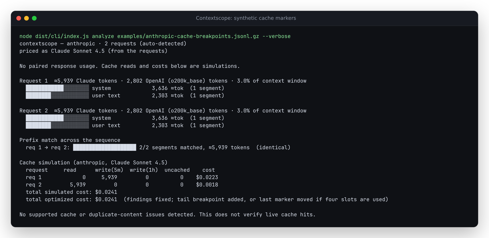
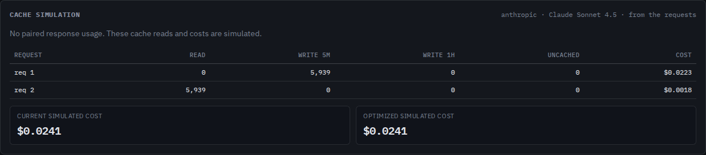

# Cache accounting with several Anthropic breakpoints

In the source checkout, a later cache hit covers earlier breakpoints before any
write charges are assigned. Previously, adding an earlier marker could bill the
same prefix as both a read and a write. These corrections are unreleased.

The retained [synthetic example](../examples/anthropic-cache-breakpoints.jsonl.gz)
sends the same system text and user context twice. The first request caches the
whole prompt for five minutes. The second adds a one-hour marker on the system
text, keeping the final five-minute marker. Its estimated input is 5,939 tokens:

| Second request | Before | Corrected |
| --- | ---: | ---: |
| Cache reads | 5,939 | 5,939 |
| One-hour writes | 3,636 | 0 |
| Total tokens accounted | 9,575 | 5,939 |
| Simulated input cost, USD | 0.0235977 | 0.0017817 |

These are controlled inputs and estimated costs using the repository's Sonnet
4.5 price table. They are not an API measurement or a bill.



```sh
npm ci
node dist/cli/index.js analyze examples/anthropic-cache-breakpoints.jsonl.gz --verbose --json cache-report.json --html cache-report.html
```

The browser accepts the same compressed file. **Save report** downloads every
request as JSON or offline HTML, including when no provider usage was captured.
The JSON omits prompt text; HTML also omits prompt bodies but retains readable
findings, labels and source paths. Review those before sharing.



The [phone capture of the download controls](assets/cache-accounting-exports-mobile.png)
shows both export buttons without page overflow. The six-column cache table uses
its existing horizontal scroll region on narrow screens.

## Accounting rule

[Anthropic's prompt-caching documentation](https://platform.claude.com/docs/en/build-with-claude/prompt-caching#mixing-different-ttls)
defines billing from the longest cache hit and the remaining marked regions.
The simulator first searches all eligible breakpoints, then assigns disjoint
token ranges:

```text
0                  A                 B                 C              total
|---- cache read ---|--- 1h write ----|--- 5m write ----|--- uncached ---|
                   longest hit      last 1h marker   last marker
                                    after the hit
```

An earlier missed marker inside the longest hit adds no write charge. If no
one-hour marker follows the hit, B equals A. A request without an eligible
breakpoint counts entirely as uncached input. Eligible prefixes still have to
meet the selected model's minimum estimated token count.

## Lookup and marker limits

The documented lookup examines 20 positions **including the breakpoint itself**.
The corrected simulator accepts a prior entry 19 positions behind and refuses
one 20 positions behind. Consecutive tool-use blocks share one position;
consecutive tool-result blocks do too. The findings use the same position map.

The hypothetical optimized scenario adds a five-minute marker at the last
cacheable block. If four markers already exist, it moves the last one there and
keeps its TTL. Thinking and empty text cannot receive that marker. An empty
tool-result block can: its routing information still exists.

Malformed marker types or TTLs, more than four effective markers, conflicting
automatic/explicit TTLs, one-hour markers after five-minute ones, and explicit
markers on thinking or empty text stop analysis with the request and field
location. The CLI exits 1 without writing a report. A failed browser replacement
keeps the previous successful report. This is validation of the modeled cache
configuration, not a complete validation of the provider's request schema.

## Evidence and boundaries

The [replay study](../studies/cache-accounting/README.md) retains before/after
outputs, the deterministic input generator, and the historical corpus comparison.
Tests independently apply the documented billing partition to all valid
four-block marker arrangements and exercise the lookup boundary, optimized
placement, invalid inputs and actual browser downloads.

The simulation still assumes requests arrive before cached entries expire.
It does not observe eviction, concurrent request completion, provider rendering,
or live cache state. Claude token counts remain estimates. A mixed-model file
still uses one resolved pricing/minimum-length table while separating cache
entries by request model; split the file by model for model-specific estimates.
