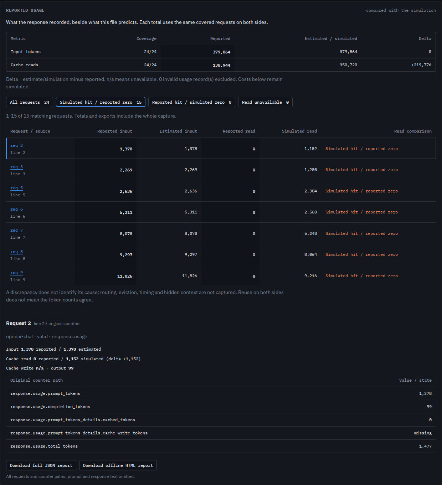
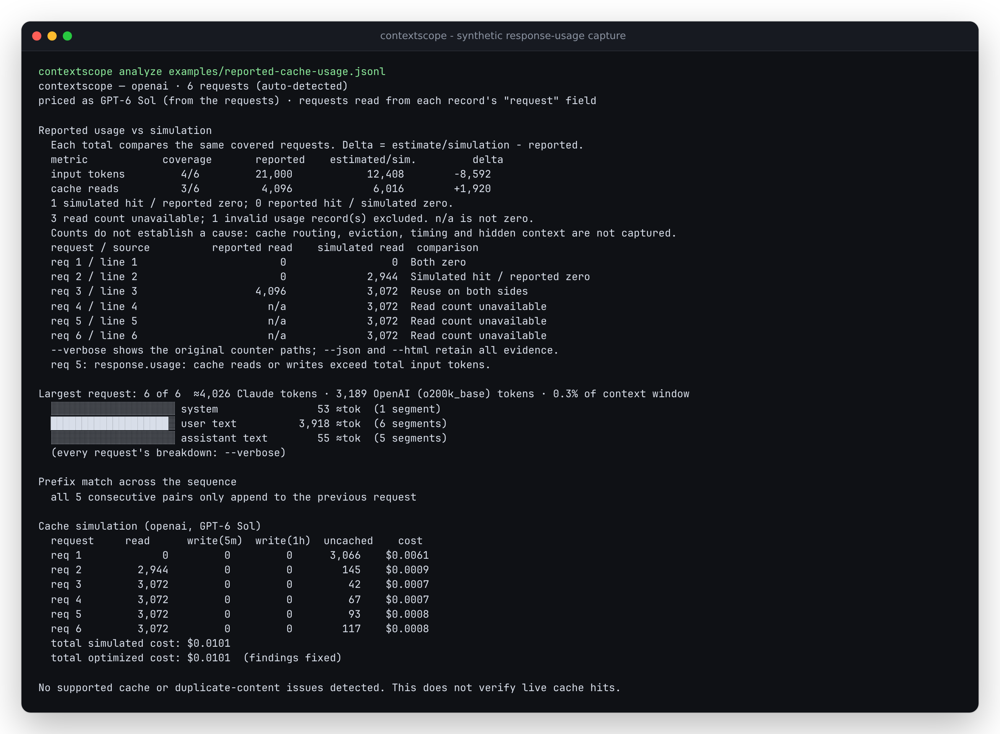
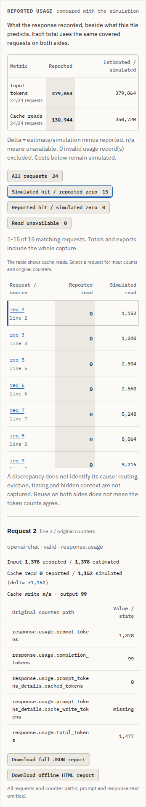
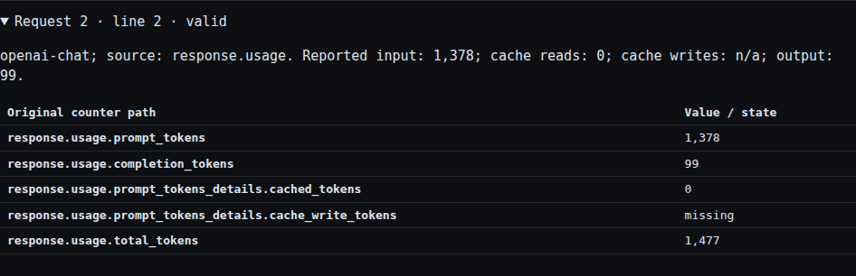

# Compare captured usage with the simulation

Available in the source checkout; not yet released to npm or the hosted demo.

A stable prefix is evidence that a request could reuse a cache. The response's
usage counters record whether it did. Contextscope keeps those two accounts
separate and lets you inspect the requests where they differ.



This screenshot uses a reconstructed mini-SWE-agent Chat Completions capture:
`20251211_mini-v1.17.2_gpt-5.2-2025-12-11`, `django__django-14725.traj.json`.
Only derived counters are shown. The [verification study](../studies/reported-usage/README.md)
describes reconstruction, source hashes and limitations. The built-in example
uses explicitly synthetic counters instead; no public trajectory text is bundled.

## Capture shape

Keep one complete response beside the request it answers. For example:

```json
{
  "request": {
    "model": "gpt-5.2",
    "messages": [{"role": "user", "content": "Review this change."}]
  },
  "response": {
    "usage": {
      "prompt_tokens": 12,
      "prompt_tokens_details": {"cached_tokens": 0},
      "completion_tokens": 20,
      "total_tokens": 32
    }
  }
}
```

These example counts are authored, not API measurements. The request wrapper
can be `request`, `request_body`, `body`, or `params`; request strings containing
JSON are decoded as before. With a wrapped request, these usage locations work:

| Response shape | Counter source prefix |
|---|---|
| `response: {usage: {...}}` | `response.usage` |
| `response_body: {usage: {...}}` | `response_body.usage` |
| `response: {body: {usage: {...}}}` | `response.body.usage` |
| `usage: {...}` beside the wrapped request | `usage` |

`response`, `response_body`, and `response.body` may also contain JSON strings.
Multiple usage objects in one record are rejected as ambiguous. Usage inside a
raw request, a tool result, or a standalone response record is not attached to
another request. Separate Batch request/output files must be joined explicitly
by their identifiers before import. Array order and adjacent lines do not prove
that two records belong together. Assemble streaming usage into one final
response before import; this reader does not merge SSE deltas.

## Counter semantics

| Format | Total input | Cache read | Cache write |
|---|---|---|---|
| OpenAI Chat Completions | `prompt_tokens` | `prompt_tokens_details.cached_tokens` | `prompt_tokens_details.cache_write_tokens`, when reported |
| OpenAI Responses | `input_tokens` | `input_tokens_details.cached_tokens` | `input_tokens_details.cache_write_tokens`, when reported |
| Anthropic Messages | `input_tokens + cache_read_input_tokens + cache_creation_input_tokens` | `cache_read_input_tokens` | `cache_creation_input_tokens` |
| Chat-shaped Claude gateway response | Withheld when creation is positive or unavailable | Native `cache_read_input_tokens` or nested `cached_tokens` | Native `cache_creation_input_tokens` or nested `cache_creation_tokens` |

Anthropic's three input categories are disjoint; OpenAI's input count already
includes cached tokens. See the official [Anthropic usage breakdown](https://platform.claude.com/docs/en/build-with-claude/prompt-caching#tracking-cache-performance)
and [OpenAI prompt-caching guide](https://developers.openai.com/api/docs/guides/prompt-caching),
checked 2026-10-08. Chat Completions' optional detail fields are documented in
the [response reference](https://developers.openai.com/api/reference/resources/chat/subresources/completions/methods/retrieve).
Output counts are retained separately and never added to input comparisons.

Historical gateway `prompt_tokens` values may exclude or include cache creation.
The source often does not identify the gateway version or its counting contract.
For these captures, total input is available only when creation is explicitly
zero. Cache reads, writes, output and the original prompt counter remain
inspectable. A note explains why a nonzero original counter cannot safely be
used as total input. Export native provider usage to remove this ambiguity.

Missing and null counters remain unavailable. An Anthropic record missing any
input partition has no derived total, even when its cache-read counter is known.
No output count or write TTL is invented. Cache-creation TTL counters are retained
and checked against a reported write total when present.

Numbers must be nonnegative safe integers. Malformed values, conflicting aliases,
inconsistent totals and cache partitions exceeding a known input total exclude
the whole usage record. Its source paths, individually valid counters and reasons
remain in the report. Arbitrary invalid values and response text are not copied
to the export. Aggregate sums beyond the safe integer range become unavailable
with an explicit note; individual rows remain accessible.

## Review and export

From this checkout:

```sh
npm ci
node dist/cli/index.js analyze examples/reported-cache-usage.jsonl --json report.json --html report.html
npm run dev:web
```

The synthetic six-request capture includes a reported zero where the simulation
predicts a hit, positive reads, missing counters, an inconsistent count, and a
request without a response. CLI `--verbose` displays each original counter path.
Adding `--fail-on error` exits 2 for this example's invalid usage, while still
writing the reports. Missing optional usage alone does not fail a gate.



In the browser, use **Simulated hit / reported zero**, **Reported hit / simulated
zero**, or **Read unavailable** to narrow the table. Select a request to see
its original line or record position and every supported counter path. The
request tabs and this inspector stay aligned. Rows have 25-request pages;
the totals and both downloads always retain the entire capture.

Each metric has its own covered cohort. If input is known for requests 1 and 3,
both input totals use exactly requests 1 and 3. Cache reads may cover a different
set. JSON includes the exact zero-based request indices for each aggregate.
Delta is always estimate/simulation minus reported. A reported zero counts as
coverage; an unavailable counter does not. "Reuse on both sides" describes
positive counts and does not imply numerical agreement.

A paired response whose request has no analyzable prompt remains inspectable,
but is excluded from comparisons. JSON lists these requests explicitly in
`uncomparedRequestIndices`; the missing prompt is never assigned a zero estimate.

```text
paired record
  request  -> token estimate -> cache simulation --+
  response -> validated usage --------------------+--> same-request comparison
                                                     + source counter paths
```

The JSON download is the same prompt-free summary as CLI `--json`, now also
exported as `toJsonReport(result)` from the library. It retains all comparison
rows and original counter paths. The offline HTML contains all rows and native
expandable counter sections, works through `file://`, and needs no scripts,
fonts, images or network requests. Exports still include structural metadata
such as model/tool names; they are not an anonymization tool.

## What a difference establishes

It establishes a disagreement between a captured counter and the local model.
It does not identify cache routing, eviction, expiration, hidden server history
or a gateway rewrite as the cause. In particular, a first request may report
reuse from an earlier request absent from the file. Stored Responses history can
make a reported input total larger than the visible prompt.

Response usage is accepted as captured evidence, not independently authenticated.
The pairing supplied by the capture is trusted. The simulator and token
estimator remain unchanged by reported usage; response counts do not silently
recalibrate Claude estimates. Costs remain simulated, using the existing price
snapshot. New OpenAI write counters are retained as evidence; explicit cache
write placement and its cost are not newly modeled here.




