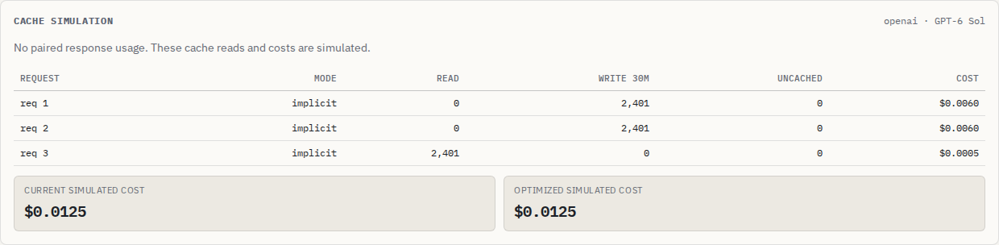

# Offline browser analysis - October 9, 2026

Runtime change: `a08dc95`, after the schema-identity correction `28245ea`.

## Reproduced failure

On the production build, load the OpenAI cache-mode example, disconnect, and
import another local JSON file. The six old rows remain, with this error:

```text
Could not analyze this input: Analysis worker failed: could not load or process this log. Try importing the log again.
```

Chromium reported `net::ERR_INTERNET_DISCONNECTED` for the worker asset. Exports
worked offline, but each new analysis started a disposable Blob worker whose
bootstrap imported its code from the network again. Loading the engine once
did not make subsequent local analysis independent of the connection.

## Change

The production loader retains the trusted, same-origin worker bundle after it
executes successfully. Every operation still starts and terminates its own
worker, dropping request-bearing computation and tokenizer caches. The retained
string contains application code, not request data. Blob workers inherit the
page's Content Security Policy; no policy was relaxed.

```text
first operation: fetch code -> start worker -> retain validated code
each operation:  code -> new worker -> result / cancellation -> terminate
                                                     -> revoke Blob URL
```

The download is cancellable. HTML error responses and JavaScript that fails
to start are not retained, so a later import can retry. A worker created after
its operation was cancelled is terminated before receiving the request.

The development server keeps its original URL-based module loading because
development modules have relative imports. Offline operation applies to the
production build in the same open tab after its first analysis. A page reload
or an unvisited built-in example can still need a connection; no persistent
offline installation is claimed.

## Verification of the production browser change

A detached checkout of `a08dc95`, with a fresh `npm ci` under Node 24.21.0,
passed lint, both TypeScript projects, all 426 core checks, the production build
and all 82 Chromium/Firefox workflows. The build command is `npm run build`;
the deployable site is `web/dist/`.

The browser checks cover a new local import after disconnecting, model changes,
manual calibration, reset, cancellation of active computation, cancellation
during the first code download, HTML/truncated-script recovery and inherited
`connect-src` enforcement. Workers still terminate and revoke their Blob URLs.

The shared [live checker](../studies/openai-cache/check-live.mjs) first loads
the cache-mode example, disconnects, downloads its report, then imports the
A/B/A schema sequence as a new local file and downloads that report too.
This same sequence failed before the worker-loader change.



The screenshot was captured from the production preview after the browser
context was put offline. It is a synthetic schema-order example; the displayed
counts and costs are simulations, with no provider calls.

## Publication checked

Runtime source `a08dc95` is pushed to `main`; Pages commit `55e6202` contains
the verified production build. On the live site, Chromium loaded the example,
went offline, downloaded its JSON, imported a fresh schema sequence, and
downloaded that result too. Reads were `[0, 0, 2401]`, with no page errors.
[The retained live result](../studies/openai-cache/offline-live-verification.json)
includes the served asset, browser version and check time. The final evidence
commit changes documentation and artifacts only.

## CLI verification for the preceding schema correction

The core/CLI source did not change between `28245ea` and `a08dc95`. A clean
checkout of `28245ea` passed fresh installation, lint, type checking, 424 core
checks, production build and all 74 then-existing browser workflows.

Its packed CLI/library was installed in an empty prefix and checked on Node
20.0.0, 24.21.0 and 26.7.0. All eight examples retained token conservation and
the expected cache-mode behavior; invalid inputs preserved existing reports.
The installed A/B/A structured-output schema sequence changed cache reads from
`[0, 2401, 2401]` to `[0, 0, 2401]` on each engine.

Package: `antonsoloviev-contextscope-0.3.3.tgz`, 91,014 bytes,
SHA-256 `e59070846f0e1a94c3b25fcf6569359b3ca850d5f77b72bf7f16b4a18c950aa8`.
No registry publication was performed. Retained results:
[examples](../studies/openai-cache/schema-installed-examples.json),
[schema identity](../studies/openai-cache/schema-installed.json).
