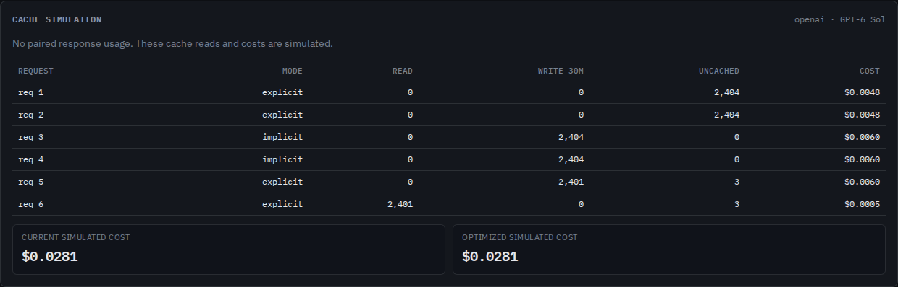
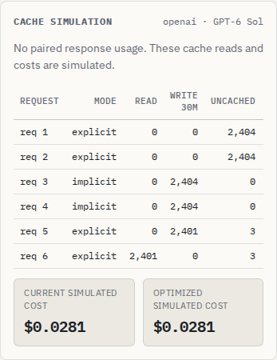
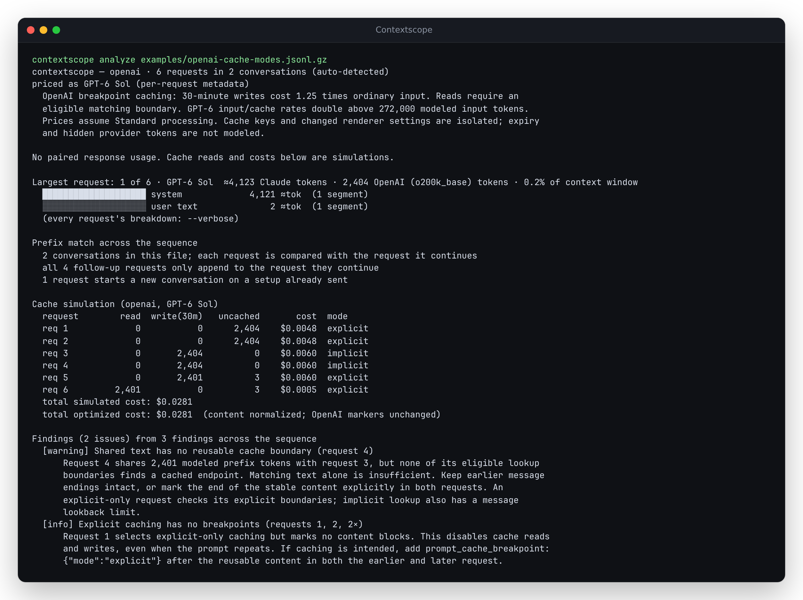

# OpenAI cache verification - October 9, 2026

Runtime commit: `39b8fb1`. Baseline: `dbd7e15`.

This records the initial breakpoint implementation. The later
[schema-order correction and offline workflow](verification-offline-analysis-2026-10-09.md)
include newer verification and deployment evidence.

The [counterexample study](../studies/openai-cache/README.md) retains SDK-generated
inputs and before/after accounting. Explicit mode without markers no longer
gets a simulated hit. Implicit caching respects message endpoints; explicit
markers preserve stable content before a changing suffix. Cache keys and
renderer settings isolate state, and modern writes use a separate price.

## Verification performed

- A detached checkout of `39b8fb1` with a fresh `npm ci`, under Node 24.21.0:
  `npm run lint`, `npm run typecheck`, `npm test`, `npm run build` and
  `npm run test:browser` all succeeded. There were 423 core checks and 74
  Chromium/Firefox workflows. The production site is `web/dist/`.
- The new browser workflow checks all three modes, inspects the explicit
  marker, and exports JSON plus script-free HTML while offline. The downloaded
  HTML opens through `file://` and retains the corrected rows. Desktop 1440px
  dark and mobile 375px light have zero Axe violations, no page overflow and
  no page errors. The table scrolls horizontally on mobile.
- The clean checkout was packed, then installed into an empty prefix.
  All eight examples produced JSON and HTML on Node 20.0.0, 24.21.0 and 26.7.0
  (24 invocations). Both simulation scenarios conserve tokens. The installed
  modern example has the expected reads, writes, costs and findings. Invalid
  Anthropic markers and OpenAI cache options exit 1 without replacing an
  existing report. [Machine-readable results](../studies/openai-cache/installed-verification.json).
- All 120 hash-pinned historical OpenAI Chat trajectories were replayed:
  2,205 requests, zero changed cache partitions or usage comparisons, and
  zero input-count disagreements with captured usage. Prices now resolve to
  GPT-5.1/5.2. [Historical evidence](../studies/openai-cache/legacy-replay.json).
- A generated 300-request, 21,547,099-byte Responses history took a median
  2.15 seconds over three timed analyses after warmup on Node 24.21.0.
  Browser checks were running concurrently; this is a responsiveness check,
  not a speedup claim. The old build took 2.17 seconds in the same procedure.
  [Generator](../studies/openai-cache/benchmark.mjs) and
  [measurements](../studies/openai-cache/benchmark.json).

Machine: 14-vCPU WSL2 Linux, 48 GB RAM.

Local package artifact: `antonsoloviev-contextscope-0.3.3.tgz`, 90,953 bytes,
SHA-256 `9f3f1a05cbd2dbe4d318176acae4da66ecf871ea1daef8e3b83394e346df3344`.
The package version is unchanged. No registry publication was performed.

## Publication checked

Source `39b8fb1` was pushed to `main`; Pages commit `2cd5a67` contains the
verified `web/dist/` build. Chromium then loaded the live example from
`https://antonsoo.github.io/contextscope/`, verified all six token partitions
and the $0.0281307 total, and downloaded its JSON after going offline. No page
errors occurred. [Live result](../studies/openai-cache/live-verification.json)
records the served asset name and check time; [the checker](../studies/openai-cache/check-live.mjs)
can repeat that workflow. Documentation-only commits after the runtime commit
do not change this deployed build.

## Inspectable output

## Limits

The SDK transport is mocked; no inference or counting API was called. The
historical corpus verifies legacy compatibility, not modern server behavior.
The guide and generated API reference disagree on the explicit lookup window;
the implementation follows the guide, and the study records the conflict.
Hidden framing, provider rendering, retention/eviction and non-Standard pricing
remain outside the model. Simulated costs are not measured bills.
